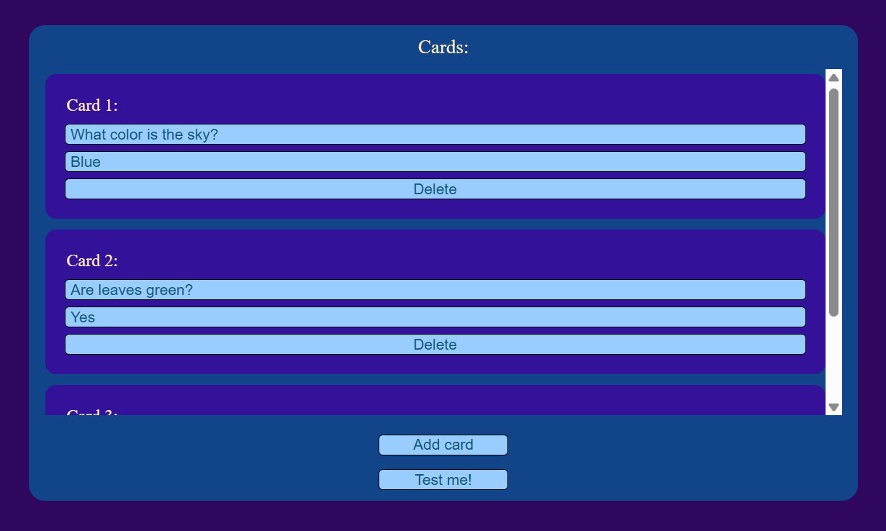
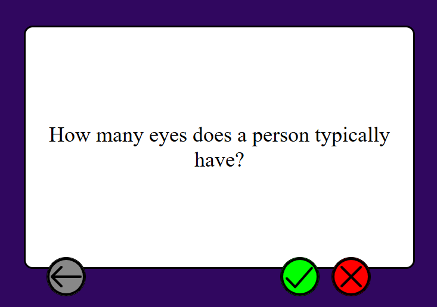
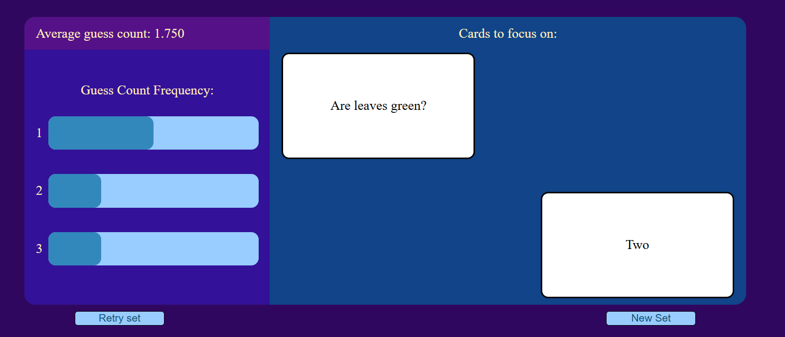

# Flashcards
A simple flashcard website I made where you can input your terms and it will shuffle them for you. It randomly mixes terms that you guessed incorrectly back into the mix until you get them right.

# How to use:
1. Go to <https://cattacocattaco.github.io/Flashcards/>

2. Add your first term and answer to card 1 through the labeled text inputs
3. Press add card to add a second card and fill in the term and answer fields with another card
4. Repeat until you have added all cards you wanted to add
5. Press the "Test me!" button to be tested on your card set

6. For each card, you can press the card to see the answer (And again to go back to the term)
7. If you guessed the card correctly, press the check. Otherwise, press the X
8. If you want to see a previous card, you can use the back arrow button to go back
9. If you mess up, you can go back to the previous card and press the check or X button (there will only be one of them) to reclassify the card
10. Once done, you will see stats about how many guesses you took and what cards challenged you the most

11. You can press the "Retry" button to try the set again or you can press the "New set" button to create a new set to test yourself on
